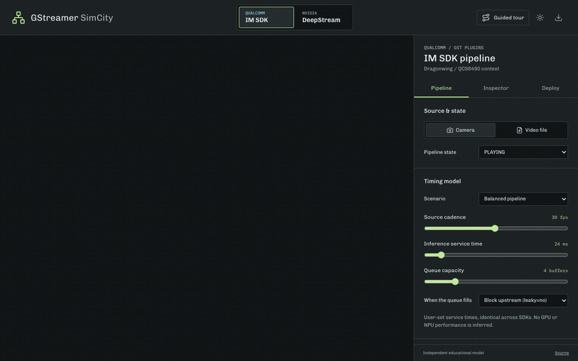
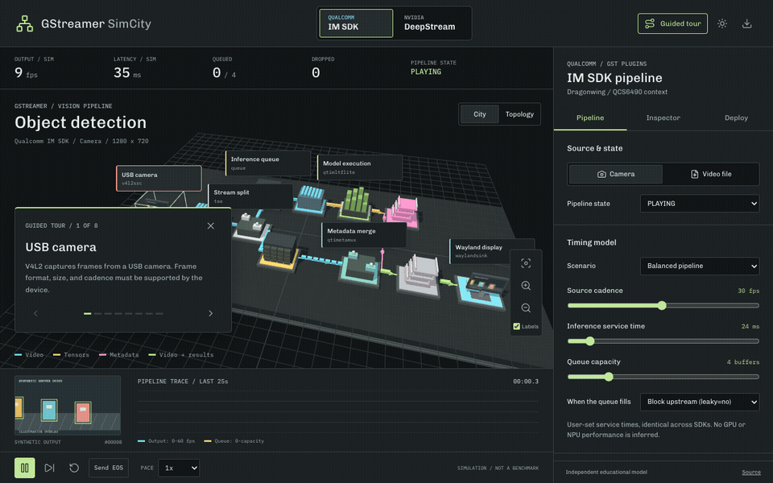

# GStreamer SimCity

An explorable pipeline city with swappable **Qualcomm IM SDK** and **NVIDIA DeepStream** reference architectures. Follow video buffers, tensors, and detection metadata through the elements; inspect their contracts and see how a bounded inference queue changes latency, drops, and backpressure.



The starting point is the [Multi-Solutions Workshop](https://github.com/eoinjordan/multisolutions_workshop): QCS6490 deployment, QNN verification, the IM SDK camera/file wrappers, and the distinction between requested acceleration and measured execution.

**Independent educational model.** No native GStreamer, QNN, TensorRT, or camera process runs in the browser. The video is generated, the boxes are illustrative, and all timing is simulated. SDK switching changes the graph, inspector, and deployment notes; it does not make vendor binaries or model files interchangeable. Not affiliated with Qualcomm, NVIDIA, or the GStreamer project.

## Explore

- Full 3D city, topology view, orbit/zoom, day/night, and selectable elements.
- Eleven IM SDK stages or eight DeepStream stages with input/output contracts, execution context, official references, and validation caveats.
- Camera/file profiles, finite file EOS, a guided camera tour, and an accessible element index.
- Configurable frame cadence, inference service time, queue capacity, and all three queue leakage policies.
- Pause, single-frame-interval stepping, NULL/READY/PAUSED/PLAYING controls, EOS draining, buffer accounting, and a rolling trace.
- Separate launch notes for each SDK, clipboard/download actions, and JSON simulation snapshots.

### Guided Tour



## The Two Pipelines

| Concern | Qualcomm IM SDK / current QIM reference | NVIDIA DeepStream / Jetson reference |
| --- | --- | --- |
| Live source | USB V4L2 capture and video conversion | Argus CSI capture and NVIDIA conversion |
| File input | MP4 demux/parser and V4L2 H.264 decode | MP4 demux/parser and NVIDIA H.264 decode |
| Organization | Tee, raw-video branch, separate ML branch | Batched video with attached metadata |
| Preprocess | `qtimlvconverter` | Inside `nvinfer` by default |
| Inference | `qtimltflite`, QNN delegate / HTP requested | `nvinfer`, TensorRT / GPU |
| Detection results | `qtimlpostprocess` produces metadata; `qtimetamux` attaches it | Object metadata attached to video buffers |
| Overlay | `qtivoverlay` | `nvdsosd` after format conversion |
| Output | Wayland or an encoder/mux/filesink bin | Jetson display or an encoder/mux/filesink bin |

The graph uses **current QIM plugin names**. The workshop's older exported IM SDK deployment can differ. Its bundled scripts and README remain authoritative; the version boundary is explained in [deployment notes](docs/deployment.md).

## Run Locally

Node.js 22.12+ or 24 LTS is recommended.

```bash
npm ci
npm run dev -- --host 127.0.0.1
```

```bash
npm run typecheck
npm test
npx playwright install chromium
npm run test:browser
npm run build
```

Browser tests serve the production build under `/__pages_test__/`, check desktop and mobile canvas pixels and framing, and exercise SDK switching, controls, tours, and exports.

To regenerate the GIFs with the app running on port 4179, install FFmpeg, then:

```bash
node tools/record-demo.mjs http://127.0.0.1:4179/
```

## Controls

Drag the scene to orbit and use the wheel/pinch or zoom buttons to change distance. Select a labelled element or use the Inspector's element index. Focus is kept separate from transport state.

| Key | Action |
| --- | --- |
| Space / P | Pause or play |
| T | Start or stop the tour |
| R | Reset the simulation |
| H | Frame the whole pipeline |
| N | Day / night |
| 1 / 2 | IM SDK / DeepStream |
| Escape | End the tour |

Shortcuts do not intercept form controls. Reduced-motion preference starts paused and disables automatic tour advancement; explicit controls remain available.

## Verification And Limits

The queue is a deterministic 5 ms teaching model, not a GStreamer emulator. The city shows the wider architecture, but the queueing calculation represents one bottleneck and collapses other scheduling stages. It does not simulate allocator negotiation, hardware utilization, parallel decoder execution, metadata-mux matching, TensorRT batching speedups, or real inference accuracy.

Both SDKs start with identical timing assumptions. Lower service time is a user input, never a claimed hardware speedup. See [verification and sources](docs/verification.md) for tested arithmetic, model assumptions, and primary references.

The [benchmark roadmap](docs/benchmark-roadmap.md) records proposed branch scheduling, caps negotiation, and native-evidence work; these are not implemented capabilities.

## GitHub Pages

The workflow runs typecheck, model tests, and production browser tests while the repository is private. Deployment is intentionally skipped for private repositories and pull requests.

Once public, select **Settings > Pages > Source: GitHub Actions**, then run **Test and deploy Pages** (or push to `main`). The expected address is `https://eoinjordan.github.io/GstreamerSimCity/`. A successful deployment validates delivery of the teaching app, not native SDK execution.

## Layout

```text
src/sim/       Deterministic queue model, SDK graphs, recipes, and tests
src/world/     Three.js buildings, data paths, picking, and camera
src/main.ts    Controls, inspector, tour, trace, and export wiring
tests/         Production browser and canvas-pixel checks
docs/          Deployment boundaries, verification, recorded previews
tools/         Reproducible browser-to-GIF capture
```